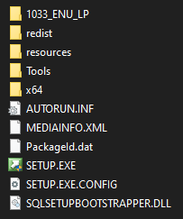

# SQL example packages

## SQL Server Example

```powershell
.\NewSqlServerPackage.ps1 -SetupDir 'c:\path\to\sql\setup\dir' -OutputDir 'c:\path\to\package\output\dir' -Force -Import
```

This example will create a new SQL Server package (*sql-server*) from a provided SQL Server setup directory and import into your Go Current server installed on the same machine. If the package already exists will be overwritten.

The SQL server directory should include these files:



## SQL Server Express Example

```powershell
.\NewSqlServerPackage.ps1 -SetupDir 'c:\path\to\sql\setup\dir' -OutputDir 'c:\path\to\package\output\dir' -Force -Import -Edition 'Express'
```

This example will create a new SQL Server Express package from provided setup directory and is imported to your Go Current server installed on the same machine. If the package already exists, it will be overwritten.
A setup file can be downloaded from [here](https://www.microsoft.com/en-us/sql-server/sql-server-editions-express), you must first download an online installer and from there choose *Download Media* where you will get a file called *SQLEXPR_x64_ENU.EXE*.

The setup directory (*-SetupDir*) should contain a file called *SQLEXPR_x64_ENU.EXE*.

## SQL Management Studio Example

```powershell
.\NewSqlServerPackage.ps1 -SetupPath 'c:\path\to\SSMS-Setup-ENU.exe' -OutputDir 'c:\path\to\package\output\dir' -Force -Server 'localhost' -Port 16652
```

This example will create a new SQL Management Studio package (*sql-management-studio*) from a provided setup file and import it to a Go Current server installed on the same machine. 
A setup file can be downloaded from [here](https://docs.microsoft.com/en-us/sql/ssms/download-sql-server-management-studio-ssms).
